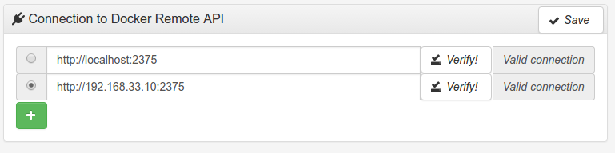

# Simple Docker UI

Simple Docker UI is an unofficial developer tool for monitoring and managing Docker containers.

Homepage: https://github.com/felixgborrego/docker-ui-chrome-app

## Installation

Simple Docker UI is a Chrome plugin, to install open te following link in chrome:

https://chrome.google.com/webstore/detail/simple-docker-ui/jfaelnolkgonnjdlkfokjadedkacbnib

## Connect to Nodevagrant

    -Go to settings tab

    -Set url in "Connection to Docker Remote API"
        Use localhost

        ```
        http://localhost:2375
        ```
        or use the VM-s IP adress

        ```
        http://192.168.33.10:2375

        ```
    -Hit the "Verify!" Button

    
