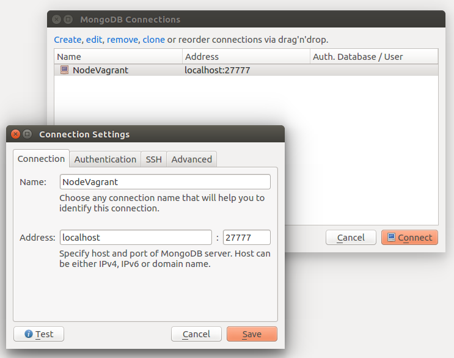

# Robomongo

Native cross-platform MongoDB management tool

Homepage: https://robomongo.org/

## Installation

Go to download page and follow instructions:

https://robomongo.org/download

## Connect to Nodevagrant

    -Go to network icon and hit Manage Connections

    -Hit Create

    -Set url in "Connection to Docker Remote API"

        Use localhost

            ```
            http://localhost : 27777
            ```


    -Hit the "Save" Button and "Connect"

    
